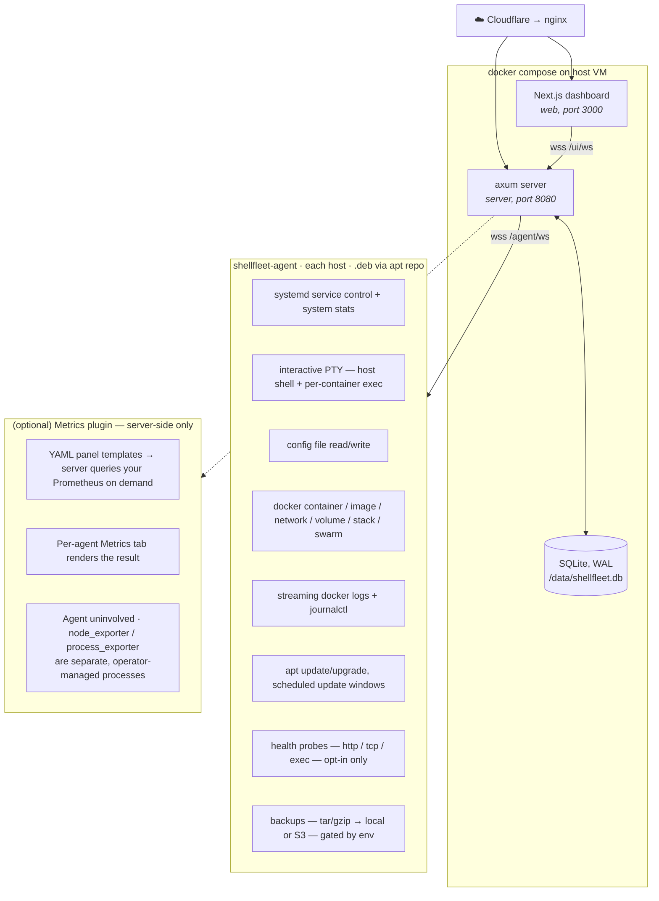

# ShellFleet

A self-hosted, terminal-flavoured fleet dashboard. One Rust agent per host (or
Pod), one axum/SQLite server, one Next.js dashboard. Manages systemd services,
Docker containers + swarm, **Kubernetes** (pods / deployments / services /
ingresses / pvcs / events + describe + live-tail logs + pod exec), apt updates,
health probes, backups, fan-out commands, and remote shells across every host
you connect.

Apt repo: <https://shellfleet-repo.sppidy.in/>  ·  Container images: <https://ghcr.io/sppidy/shellfleet>

> The agent is **cheap when nobody's looking**: ~4 MB RSS at idle, no
> background polling for stats / containers / images / networks / volumes /
> stacks. A dashboard request is the only thing that triggers those code
> paths. See "Idle cost" below.
>
> ShellFleet **doesn't compete with Prometheus — it delegates to it**. The
> agent doesn't scrape, doesn't keep a TSDB, doesn't run an exporter. Point
> the dashboard at your existing Prometheus via the metrics plugin (named
> panel templates in YAML, queried on demand) and the per-agent **Metrics**
> tab renders the result. No free-form PromQL from the browser, no metric
> storage in ShellFleet. See [Metrics](https://shellfleet.sppidy.in/docs.html#metrics).

## Quick start

1. Bring up the server + web stack from the published container images.
   [Quickstart](https://shellfleet.sppidy.in/docs.html#quickstart) has the full walkthrough --
   no GitHub access needed.
2. Install the agent on a target host via the signed apt repo
   (see **Connecting an agent** below).
3. Sign in via GitHub OAuth, paste the agent's pairing code at
   `/device`, done.

## Architecture



## Repository layout

This superproject pins four submodules — each is its own GitHub repo:

| Path     | Repo                              | Stack       | Purpose                                                  |
|----------|-----------------------------------|-------------|----------------------------------------------------------|
| `web/`   | `sppidy/shellfleet-web`           | Next.js 16  | Dashboard SPA — sidebar, per-agent tabs, command palette |
| `server/`| `sppidy/shellfleet-server`        | axum + SQLx | WS hub, REST API, GitHub OAuth, SQLite store at `/data`  |
| `agent/` | `sppidy/shellfleet-agent`         | Rust + Tokio| Per-host daemon. Shipped as a `.deb`                     |
| `shared/`| `sppidy/shellfleet-shared`        | Rust crate  | Wire-format `Message` enum + `PROTOCOL_VERSION`          |

Top-level files:

| File                       | Purpose                                                            |
|----------------------------|--------------------------------------------------------------------|
| `docker-compose.yml`       | server + web stack; agent stanza is commented for local-only tests |
| `Dockerfile.server`        | Multi-stage Rust build → distroless runtime                        |
| `Dockerfile.web`           | Next.js standalone build → node:slim runtime                       |
| `Dockerfile.agent`         | Local-test agent image (referenced by the commented compose stanza)|
| `.github/workflows/`       | `agent-deb.yml` — multi-arch (amd64 + arm64) .deb build + apt repo |
| `metrics.example.yaml`     | Drop-in starter config for the metrics plugin                       |
| `helm/shellfleet-agent/`   | In-cluster install chart for the k8s flavor of the agent           |
| `Dockerfile.agent.k8s`     | Build the k8s-flavor agent image (used by the Helm chart)          |
| `CONTRIBUTING.md`, `CLA.md`| Contribution flow + Individual Contributor License Agreement       |

## Deploy

Target shape: a small docker host (single VM) reachable over HTTPS.
Submodule commits land first, then bump the superproject pointer, then
pull and rebuild on the host.

```bash
# 1. Commit + push inside the affected submodule(s)
cd web && git commit -am "…" && git push

# 2. Bump the superproject pointer
cd .. && git add web && git commit -m "Bump web: …" && git push

# 3. Pull + rebuild on the docker host
ssh <user>@<docker-host> "cd <install-dir> && \
  git pull --recurse-submodules && \
  docker compose up -d --build server web"
```

The `.env` on the docker host carries:

| Var                                              | Required | Notes                                                                        |
|--------------------------------------------------|----------|------------------------------------------------------------------------------|
| `JWT_SECRET`                                     | yes      | Signs session cookies                                                        |
| `GITHUB_CLIENT_ID` / `GITHUB_CLIENT_SECRET`      | yes      | OAuth app                                                                    |
| `ALLOWED_GITHUB_USERS`                           | yes      | Comma list of GitHub logins permitted to sign in                             |
| `AGENT_SECRET`                                   | optional | Bare-token bootstrap path; intentionally empty in the live deploy            |
| `BACKUPS_ENABLED`                                | optional | `true` to mount `/api/backups/*` and run the backup scheduler                |
| `WS_ALLOWED_ORIGINS`                             | optional | Extra origins allowed on `/ui/ws` (UI_URL is always allowed)                 |
| `UPDATE_WEBHOOK_URL` / `UPDATE_WEBHOOK_FORMAT`   | optional | Outbound webhook on `update_window.result`. Format: `json` (default) or `slack`|
| `METRICS_CONFIG_PATH`                            | optional | Path to the metrics plugin YAML. Default `/etc/shellfleet/metrics.yaml`. Missing/invalid → plugin disabled, Metrics tab hidden |

## Connecting an agent

1. **Install the .deb** on the target host. The apt repo is signed:

   ```bash
   sudo install -m 0755 -d /etc/apt/keyrings
   curl -fsSL https://shellfleet-repo.sppidy.in/shellfleet.gpg \
     | sudo tee /etc/apt/keyrings/shellfleet.asc > /dev/null
   echo 'deb [signed-by=/etc/apt/keyrings/shellfleet.asc] https://shellfleet-repo.sppidy.in stable main' \
     | sudo tee /etc/apt/sources.list.d/shellfleet.list
   sudo apt-get update && sudo apt-get install -y shellfleet-agent
   ```

   GPG fingerprint: `9181 1FCB AB45 B996 B40E AD1E C6E2 9AC2 52C7 4AEE`.

2. **Pair it.** The agent won't connect without a token. Run the pairing
   flow once:

   ```bash
   sudo shellfleet-agent --pair
   ```

   It prints an 8-character code. Open `/device` on the dashboard, sign
   in with GitHub (must be in `ALLOWED_GITHUB_USERS`), paste the code,
   approve. The token is saved at `/etc/shellfleet/agent-token.txt`.
   Start the service:

   ```bash
   sudo systemctl restart shellfleet-agent
   ```

3. **Roll updates** via CI + apt:

   ```bash
   gh workflow run agent-deb.yml --ref main
   for h in <host-1> <host-2> …; do
     ssh -n root@$h "rm -rf /var/lib/apt/lists/shellfleet-repo.sppidy.in_* 2>/dev/null; \
                     apt-get update -qq && \
                     DEBIAN_FRONTEND=noninteractive apt-get install -y shellfleet-agent && \
                     systemctl is-active shellfleet-agent"
   done
   ```

## Local development

The web and server build with no agent attached — you'll see "no agents
connected".

```bash
# Bring up server + web with hot-reload disabled
docker compose up --build server web

# OR run the web dev server against a local server
cd web && npm install && npm run dev   # http://localhost:3000

# Build the agent natively (Linux only)
cd agent && cargo build --release
```

For a full local end-to-end test (server + web + a containerized agent),
uncomment the `agent:` stanza in `docker-compose.yml`. That stanza mounts
the host's DBus socket so the in-container agent can drive the host's
systemd.

## Metrics

ShellFleet doesn't store time-series. Bring your own Prometheus and point
the dashboard at it.

```yaml
# /etc/shellfleet/metrics.yaml — minimal
prometheus:
  url: https://prometheus.your-domain.example/api/v1
  basic_auth: { username: shellfleet, password: ${PROMETHEUS_PASSWORD} }

panels:
  - id: cpu_percent
    title: CPU %
    unit: percent
    query: |
      100 - (avg by (instance) (rate(node_cpu_seconds_total{mode="idle",instance="{instance}"}[1m])) * 100)
```

Drop the file at `METRICS_CONFIG_PATH`, restart the server, and a Metrics
tab appears on every agent. The server substitutes `{instance}` (and
`{agent_id}`, `{hostname}`) into each query — the browser sends a panel
**id**, never raw PromQL.

Worked example with `process_exporter` (top-10 processes by CPU + RSS as
panels) is in [Metrics](https://shellfleet.sppidy.in/docs.html#metrics). A drop-in starter
config is at [`metrics.example.yaml`](metrics.example.yaml).

> Why delegate to Prometheus instead of building a collector?
> (1) We'd reinvent something Prometheus already does well.
> (2) It would force the agent to run a continuous scrape loop, breaking
> the "be cheap when nobody's looking" rule. Delegation keeps the agent
> at ~4 MB idle and lets operators reuse what they already run.

## Kubernetes

The `shellfleet-agent-k8s` flavor talks to a kube-apiserver instead of (or
alongside) the host's docker / systemd. One agent = one cluster. Read-mostly:
list pods / deployments / services / ingresses / pvcs / events, describe any
of them as YAML, live-tail logs, and (opt-in) exec into any container.

Two install shapes:

```bash
# In-cluster (recommended) — Helm chart deploys a Deployment + ClusterRole
helm install sysmgr ./helm/shellfleet-agent \
  --namespace shellfleet --create-namespace \
  --set server.apiUrl=https://dashboard.example.com \
  --set server.wsUrl=wss://dashboard.example.com/agent/ws

# Out-of-cluster — .deb on a Linux host with KUBECONFIG
sudo apt install shellfleet-agent-k8s
echo 'KUBECONFIG=/etc/shellfleet/kubeconfig' | sudo tee -a /etc/shellfleet/env
```

CE ships single-cluster + read + exec/logs. Multi-cluster federation, Helm
releases UI, and namespace-scoped RBAC overlays are EE. See
[Kubernetes](https://shellfleet.sppidy.in/docs.html#kubernetes) for the operator walkthrough and
[Helm](https://shellfleet.sppidy.in/docs.html#helm) for every chart value.

> **CE/EE rule of thumb:** in-cluster Pod, kubeconfig-on-a-host, single
> kube-apiserver, read + exec/logs — **CE**. Multi-cluster, namespace-scoped
> RBAC, Helm releases, Operator-with-CRDs — **EE**.

## Wire format

`shared/` defines the `Message` enum that travels both directions over the
WebSocket. `PROTOCOL_VERSION` increments every time the enum shape changes
so the server can refuse mismatched agents at the `Register` handshake.

When adding a field to an existing variant, mark it `#[serde(default)]`
so older agents can still deserialize. New variants always require an agent
rollout.

## Security

- **Auth.** GitHub OAuth → 24h session cookie (`SameSite=Lax`, `Secure`).
- **2FA (TOTP).** Optional per-user. Enroll at `/security`. RFC 6238
  with SHA-1, 6 digits, 30 s period, ±1 step skew. Recovery codes are
  generated at enrollment time, hashed (SHA-256) at rest, burned on use.
- **RBAC.** Two roles: **admin** (read + write) and **viewer**
  (read-only). First allowlisted GitHub login that signs in gets admin;
  everyone else defaults to viewer. Override via `BOOTSTRAP_ADMIN`.
  Enforced in a tower middleware on `/api/*`: mutating methods require
  admin, all others require an authenticated, MFA-verified session.
  Admins manage roles and seats at `/admin`.
- **Seat cap.** CE is capped at **3 active seats**. New sign-ins past
  the cap are rejected at the OAuth callback; existing users keep access.
  Remove a seat at `/admin` to free one up. EE lifts this with a
  license-keyed cap.
- **Audit log.** All sign-ins, MFA events, and meaningful agent /
  scheduler actions land in the `audit` table. Visible at `/activity`.
  **7-day local retention** — an hourly task drops older rows. EE will
  offer long retention + SIEM export.
- **CSRF.** Double-submit cookie + `X-CSRF` header on every mutating
  `/api/*` route. The web client routes mutations through
  `web/src/lib/api.ts::apiFetch`.
- **WS Origin allow-list.** `/ui/ws` upgrades reject unknown origins;
  `UI_URL` is always allowed, `WS_ALLOWED_ORIGINS` adds extras.
- **Apt repo.** ed25519-signed `Release` + `InRelease`. Verified by
  `apt` against the public key at `/etc/apt/keyrings/shellfleet.asc`.
- **OAuth state CSRF.** Random per-flow state in an HttpOnly cookie,
  verified on `/auth/callback`. Defeats login CSRF where a victim gets
  lured into hitting the callback with the attacker's authorization code.
- **At-rest encryption.** TOTP secrets and recovery-code hashes are
  encrypted with AES-256-GCM. Key is `SHA-256("shellfleet-aead-v1"
  || JWT_SECRET)`, so a DB-only leak (without env vars) yields nothing.
  Format on disk: `v1:<base64-no-pad nonce>.<base64-no-pad ct>`.
- **Brute-force defence.** Per-login MFA throttle locks after 10 bad
  TOTP attempts for 15 minutes. Same shape on `/api/device/approve`.
- **Constant-time recovery-code compare.** SHA-256 hash equality runs
  through `subtle::ConstantTimeEq` — loop time doesn't leak which
  position matched.
- **WebSocket RBAC.** The `/ui/ws` upgrade pins the user's login at
  connect time and re-resolves the role from the DB on every mutating
  `SendToAgent`. Without this, HTTP RBAC middleware would be bypassable
  via WS agent-control messages.
- **JWT_SECRET fail-loud.** Server refuses to start if `JWT_SECRET` is
  unset, shorter than 32 chars, or the historical placeholder value.
- **Defence-in-depth headers.** HSTS (`max-age=31536000;
  includeSubDomains`), `X-Content-Type-Options: nosniff`,
  `X-Frame-Options: DENY`, `Referrer-Policy: strict-origin-when-cross-origin`,
  and a tight `Permissions-Policy`.
- **Branch protection.** All five repos require signed commits on
  `main`; force-push and deletion are disabled.
- **Per-real-IP rate limiting.** Token bucket on the anonymous-attacker
  surface (`/auth/*`, `/api/me`, `/api/auth/mfa/verify`) keyed off
  `CF-Connecting-IP`. 30 burst, 30 req/min steady. Defence-in-depth on
  top of Cloudflare's edge rate limiter — see
  [Cloudflare](https://shellfleet.sppidy.in/docs.html#cloudflare).

### Roadmap — Enterprise Edition

The CE feature set is the **safety floor**: every operator gets 2FA,
basic RBAC, and a short local audit log. The Enterprise Edition ships
as a separate sidecar binary that registers with CE over an extension
API and adds:

- **SSO**: SAML, OIDC, SCIM provisioning.
- **Custom RBAC** with per-resource permissions and group-based
  assignment.
- **Multi-tenant organizations** with isolated agent pools.
- **Secrets-manager integration** (Vault, SOPS, AWS Secrets Manager).
- **Long-retention audit log** with SIEM export.
- **Multi-Prometheus federation** + SaaS observability vendors
  (Datadog, New Relic, Grafana Cloud) on top of CE's single-Prometheus
  metrics plugin.
- **AI log analysis.** "Summarize the last hour of journal entries on
  host-a", "what's anomalous in this output?", "explain this error".
  Configurable via OpenAI-compatible env vars (`EE_AI_API_URL`,
  `EE_AI_API_KEY`, `EE_AI_MODEL`) — works with OpenAI, Ollama, vLLM,
  OpenRouter, or any drop-in.
- **Support SLA** + a managed hosted control plane.

CE remains fully functional without EE; EE without CE is meaningless.

## Idle cost

Continuous loops on the agent — full inventory:

1. WebSocket heartbeat — 25 s ping (well under 1 ms each).
2. Health probes the operator configured. Zero by default.
3. Apt-update window scheduler — 60 s tick that does DateTime math; only
   spawns `apt-get upgrade` when a configured cron expression matches.
   Defaults to nothing.
4. Backup scheduler — same shape, gated behind `BACKUPS_ENABLED`.

That's it. No continuous polling for stats, container lists, image lists,
network/volume/stack lists, or prune previews. **Metrics collection is
out of scope** — node_exporter (or whatever exporter you run) is its own
process, scraped by your Prometheus, queried by the dashboard server on
demand. The agent is uninvolved. When no UI is connected, average CPU is
0%. Idle RSS measured at ~4 MB.

Cost banners on every UI surface that triggers a non-trivial agent call
(Stats, Prune, Exec) document the cost model in-place so the operator
never has to guess what's running in the background.

## Telemetry

ShellFleet sends a small **anonymous** usage report (default on) so the
project can gauge roughly how many instances and users exist. Each report
contains only: a random per-install id, the version, CE/EE edition, user +
agent **counts**, and enabled-**feature names** — never logins, hostnames,
IPs, or agent ids. A one-line notice is logged on the first send.

Opt out at any time:

- set `SHELLFLEET_TELEMETRY=off` in the server's environment, or
- toggle it off on the **admin** page (`/admin`).

## Useful commands

```bash
# Tail the live server
ssh <user>@<docker-host> \
  "docker compose -f <install-dir>/docker-compose.yml logs --tail=200 -f server"

# Inspect approved agent tokens
ssh <user>@<docker-host> \
  "docker exec shellfleet-server-1 sqlite3 /data/shellfleet.db \
    'SELECT hostname, datetime(created_at,\"unixepoch\"), datetime(last_seen,\"unixepoch\") FROM tokens'"

# Build + roll a new agent .deb
gh workflow run agent-deb.yml --ref main
```

## Contributing

Pull requests welcome. Read [`CONTRIBUTING.md`](CONTRIBUTING.md)
first — it covers dev setup, the signed-commit requirement on `main`,
and the [`CLA`](CLA.md) flow. The CLA is one click on your first PR via
[cla-assistant.io](https://cla-assistant.io/).

Security issues should NOT be filed as public GitHub issues. Email
`sppidytg@gmail.com` with subject `[security] ShellFleet: ...` and
we'll coordinate a fix and disclosure timeline.

## License

[**AGPL-3.0-or-later**](LICENSE) for the Community Edition contained
in this repository. The planned closed-source Enterprise Edition
sidecar (SSO, SCIM, custom RBAC, multi-tenant, Vault, long-retention
audit log) is licensed separately to paying customers; CE remains
fully functional without it. The CLA grants the maintainer dual-
licensing rights so contributor code can flow into both.
